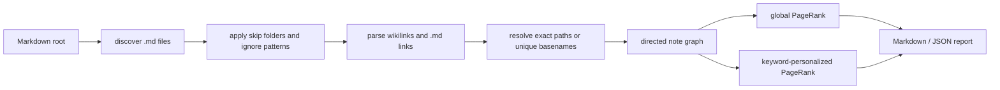

# Architecture

`markdown-link-pagerank` is a small local pipeline: discover Markdown files, resolve links, build a directed graph, rank nodes, then write reviewable reports.



## Design choices

- **No third-party runtime dependencies:** the PageRank implementation is included directly so the tool works in minimal Python environments.
- **Deterministic ordering:** ties are sorted by path so output remains stable across runs.
- **Conservative parsing:** unresolved links are counted but never guessed if a basename maps to multiple files.
- **Local-only execution:** the CLI reads from disk and writes to disk/stdout; it does not perform network I/O.

## Data model

```text
Markdown file path -> node
Resolved Markdown link -> directed edge
Unresolved link target -> report counter
Keyword list -> optional personalization vector
```

## Verification

Primary checks:

```bash
python3 -m unittest discover -s tests
python3 src/markdown_link_pagerank.py --root examples/sample-vault --output /tmp/markdown-link-pagerank-report.md --json /tmp/markdown-link-pagerank-report.json --keywords "architecture,decision,index" --limit 5
```
